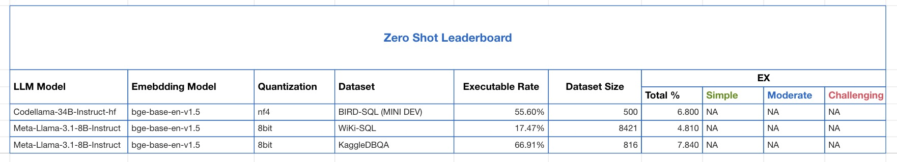

# Text-to-SQL Benchmarking for LLMs

## Overview

This project is designed to benchmark large language models (LLMs) on various Text-to-SQL datasets. It is easy to use and works "out of the box" for any LLM that can be loaded as a transformer module. We utilize the `llama-index` framework to facilitate the integration and testing of models across standardized datasets like `WikiSQL` and `BIRD-SQL`  .

## Features

- **Ease of Use:** Simple setup and execution to facilitate quick benchmarking.
- **Flexibility:** Supports a wide range of LLMs compatible with transformer architectures.
- **Extensibility:** Easily add new datasets by providing a corresponding configuration file.

## Current Result

We do zero-shot prediction, the current result is as following:
[Text-to-SQL LeaderBoard](https://www.yuque.com/alipaypk2xb9iihi/zbpaq8/xevgdnco6mt00cc2?singleDoc#O1Dd)


## Getting Started

### Prerequisites

- the datasets that you wish to test on
- The LLM model directory

### Installation
I use python 3.11 to build this version. I guess it can be runnable after python $\geq$ 3.8

Clone the repository and install the required Python packages:

```bash
git clone https://github.com/Nutingnon/text-to-sql-benchmark.git
cd text-to-sql-benchmark
pip install -r requirements.txt
```

### Usage

#### I. Generate predictions for a dataset

To start benchmarking, run the following command:

```python
python benchmark.py --config configs/your_config_file.yaml
```

Replace `your_config_file.yaml` with the path to your dataset configuration file. We provide three configure files for `WiKi-SQL`, `BIRD-SQL` and `Kaggle-DBQA`


#### II. Evaluation

Due to the [test-suite-sql-eval](https://github.com/taoyds/test-suite-sql-eval) is lack of maintainance, it cannot correctly parse many keywords in SQL, such as `CAST` and `UNION ALL`, etc.  To test model's prediction, I modified the script from BIRD-SQL:

```python
python evaluation.py \
    --predicted_sql_path <your_sql_path> \
    --ground_truth_path <ground_truth_path> \
    --db_root_path <db_root_path> \
    --pred_key <pred_key> \
    --gold_key <gold_key>
```

For example, for handling the `bird-sql` evaluation, we can run

```python
python evaluation.py 
     --predicted_sql_path ./predictions/bird-minidev/predictions_Codellama-34B-Instruct-hf.jsonl 
     --ground_truth_path ./datasets/minidev/MINIDEV/mini_dev_sqlite.json 
     --db_root_path ./datasets/minidev/MINIDEV/dev_databases 
     --pred_key predict_query
     --gold_key SQL
```

## Supported Datasets
Currently, we support (which means, have tested on) the following datasets:

- [WikiSQL](https://github.com/salesforce/WikiSQL)
- [BIRD-SQL](https://bird-bench.github.io/)
- [KaggleDBQA](https://www.microsoft.com/en-us/research/publication/kaggledbqa-realistic-evaluation-of-text-to-sql-parsers/)

If you want to test the models on more datasets, please make sure the dataset is organized well, you can refer to the preprocessing code from [UNITE](https://github.com/awslabs/unified-text2sql-benchmark).

## Call for Contributing

We welcome contributions to improve the project. If you're interested in enhancing the functionality or adding support for additional datasets, please fork the repository and submit a pull request. I am **looking forward the contributions on following aspects**:

- **Accelerating the prediction**
  - larger batch_size
  - Multi-gpu usage

- **Difficulty classification for comprehensive evaluation**
  - Evaluate the difficulty of a SQL query based on various dimensions. The classification rule can refer to two papers:
    - [Benchmarking the Text-to-SQL Capability of Large Language Models: A Comprehensive Evaluation](https://arxiv.org/pdf/2403.02951)
    - [PET-SQL: A Prompt-Enhanced Two-Round Refinement of Text-to-SQL with Cross-consistency](https://arxiv.org/pdf/2403.09732v4)

## License

This project is licensed under the **MIT License** - see the [LICENSE](https://opensource.org/license/mit) file for details.

## Acknowledgements

- Thanks to the following projects and resources, which provide code base for this project:
  - [UNITE: A Unified Benchmark for Text-to-SQL Evaluation](https://github.com/awslabs/unified-text2sql-benchmark?tab=readme-ov-file)
  - [test-suite-sql-eval](https://github.com/taoyds/test-suite-sql-eval)
  - [BIRD-DEV](https://github.com/AlibabaResearch/DAMO-ConvAI/tree/main/bird)
  - Contributors and users who have provided valuable feedback and suggestions.
